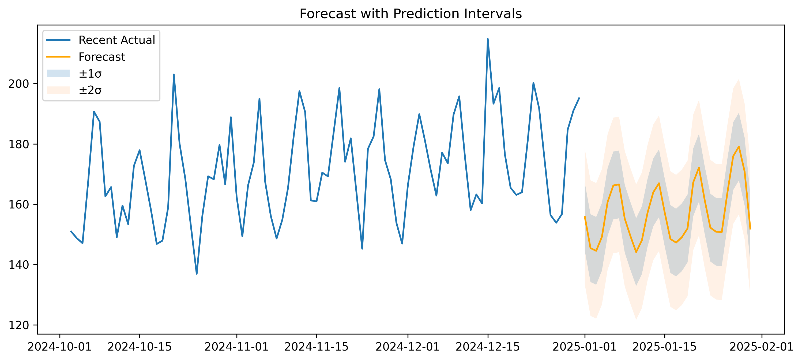

# __Data_analyst_internship_projects🤖📊__

This repository contains projects completed during my AI/Data Analytics internship.  
It includes two end-to-end machine learning workflows:

1. **Customer Churn Prediction**  
2. **Sales Forecasting**

---

## 🚀 Projects

### 1️⃣ Customer Churn Prediction
- **Goal**: Predict whether a customer will churn (leave a service).  
- **Techniques**:  
  - Data preprocessing & feature engineering  
  - Logistic Regression, Random Forest  
  - Model evaluation with accuracy, recall, ROC-AUC  

#### 🔑 Results:
**Best Model: Random Forest**  
- Accuracy: ~65%  
- Recall: ~80%  
- ROC AUC: ~0.67  

📈 **Insights**
- Random Forest performed better than Logistic Regression.  
- High recall (~80%) means the model captures most churners, which is critical for business.  

👉 Detailed workflow: [`customer_churn/README.md`](customer_churn/README.md)

---

### 2️⃣ Sales Forecasting
- **Goal**: Forecast daily sales and future demand.  
- **Techniques**:  
  - Time series feature engineering (lags, rolling means, calendar features)  
  - Baseline Naive forecast  
  - Random Forest & XGBoost models  
  - Residual analysis and prediction intervals  

#### 🔑 Results:

| Model         | MAE    | RMSE   | Notes                                |
|---------------|--------|--------|--------------------------------------|
| Naive (Lag-1) | 13.603 | 16.571 | Baseline using yesterday’s sales      |
| Random Forest | 10.188 | 13.107 | Best performer (lowest error)         |
| XGBoost       | 13.537 | 16.182 | Did not outperform baseline/RF        |

- Residual std (σ): **11.24**  
- Forecast for early January 2025: ~145–160 units/day  

#### 📊 Key Visuals:
- Actual vs Predicted  
- RF vs XGB vs Actual  
- Residual Analysis  
- 30-day Future Forecast with Prediction Intervals  



👉 Detailed workflow: [`sales_forecasting/README.md`](sales_forecasting/README.md)

---

## ⚙️ How to Run

1. Clone the repo:
```bash
git clone https://github.com/your-username/ai_internship.git
cd ai_internship

2. Install dependencies:
   pip install -r customer_churn/requirements.txt
   pip install -r sales_forecasting/requirements.txt

3. Run notebooks:
   jupyter notebook


🛠️ Tech Stack

Python (pandas, numpy, scikit-learn, matplotlib, seaborn)
XGBoost
Jupyter Notebook
Git & GitHub

✍️ Maintainer

SAKSHI SINGH
🎯 B.Tech Textile Engineering, VJTI (2027)
📌 Internship Projects: Customer Churn + Sales Forecasting

---
