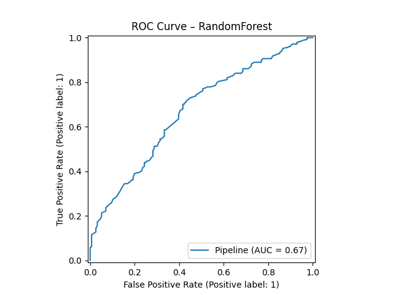
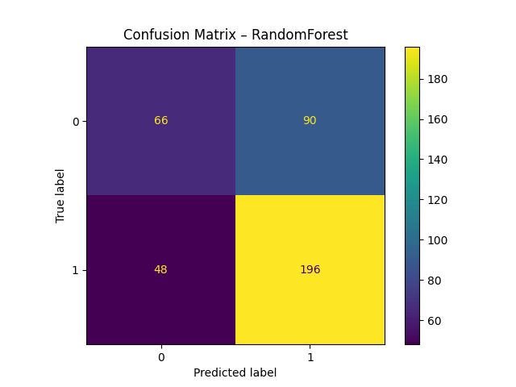

# 📊 AI Internship Projects  

This repository contains machine learning projects completed during my internship.  
Each project applies data-driven techniques to solve real-world business problems.  

---

## 📂 Projects  

### 1️⃣ Customer Churn Prediction ✅  

#### 🔎 Project Overview  
This project predicts whether a customer will churn (stop using a service) based on their demographic and service usage data.  
The goal is to help businesses identify customers at risk and take retention actions.  

#### 📁 Dataset  
- File: `customer_churn/data/churn_synthetic.csv`  
- Size: 2000 records, 21 columns  
- Key features: `tenure`, `InternetService`, `Contract`, `MonthlyCharges`, etc.  
- Target: `Churn (Yes/No)`  

#### 📊 Data Insights  
- Churn rate in dataset: **61%**  
- Customers with shorter tenure and higher monthly charges are more likely to churn.  

#### 🧠 Modeling  
We trained and evaluated two models:  
- Logistic Regression  
- Random Forest Classifier ✅ (best)  

**Best Model: Random Forest**  
- Accuracy: ~65%  
- Recall: ~80%  
- ROC AUC: ~0.67  

### 📊 Visualizations  

- **ROC Curve** shows Random Forest separates churners better than Logistic Regression.  
- **Confusion Matrix** highlights correct vs misclassified churn predictions.  

  
  
  
 

---

## ⚙️ Installation  

1. Clone this repo:  

```bash
git clone https://github.com/cwsakshi/ai_internship_projects.git
cd ai_internship_projects

2. Create and activate a virtual environment:

 ```bash
python3 -m venv venv
source venv/bin/activate   # Mac/Linux
venv\Scripts\activate      # Windows

3. Install dependencies:
 ```bash
pip install -r requirements.txt

🚀 How to Run

Customer Churn Project

Open Jupyter Notebook:
```bash
jupyter notebook

Run all cells in:
```bash
customer_churn/notebooks/02_modeling_and_evaluation.ipynb
