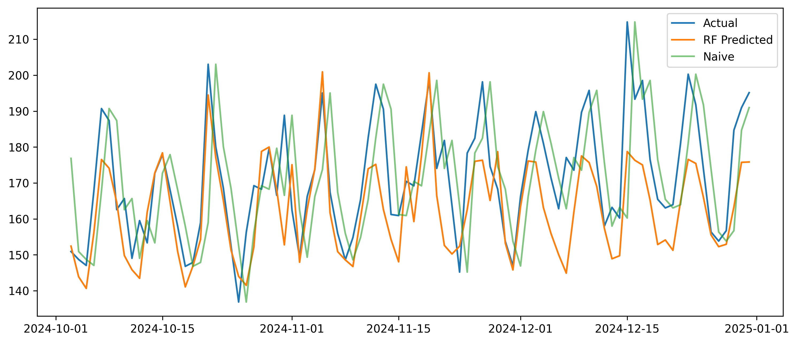
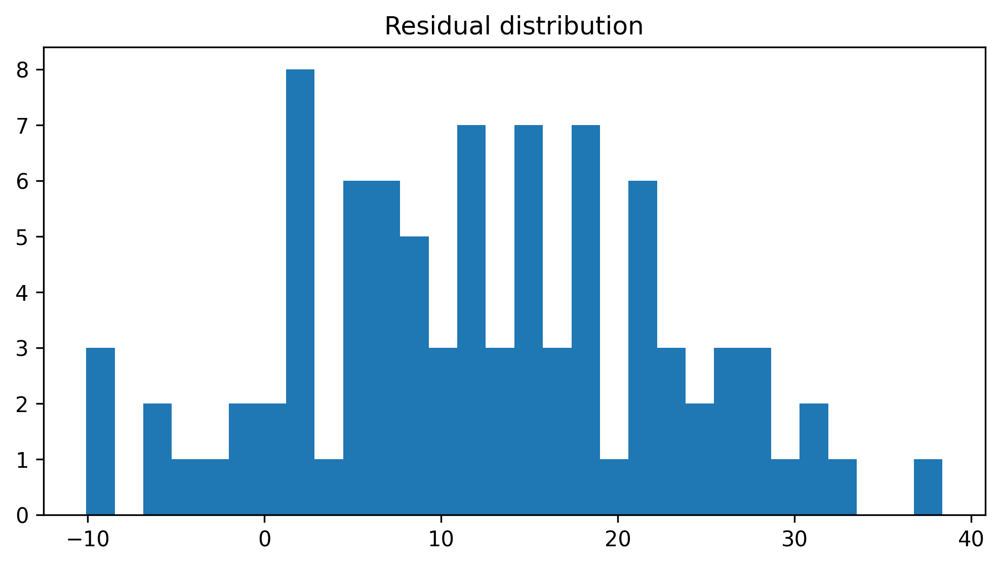
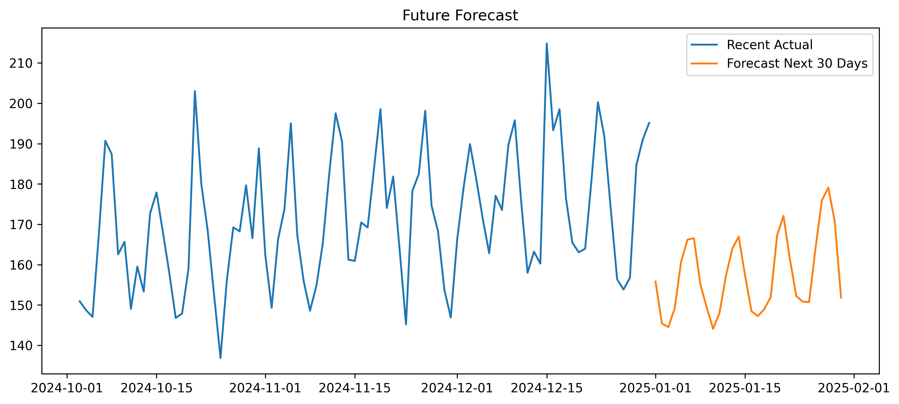

# Sales Forecasting Project 📈

## Overview
This project builds and evaluates machine learning models to forecast daily sales using historical data.  
The pipeline covers the full workflow:

- **Data Preparation**: cleaning & feature engineering (lags, rolling means, time features).  
- **Baseline Model**: Naive forecast (yesterday’s sales).  
- **Machine Learning Models**:
  - Random Forest Regressor
  - XGBoost Regressor (or HistGradientBoosting if XGB not available)  
- **Evaluation**: Holdout validation, residual analysis, and rolling-origin backtesting.  
- **Forecasting**: 30-day forward forecast with prediction intervals (±1σ, ±2σ).  
- **Deployment**: Notebook `03_evaluation_and_deployment.ipynb` generates results & saves outputs.  

---

## Project Structure
             

├── sales_forecasting/
│ ├── data/
│ │ ├── prepared_sales.csv
│ │ ├── holdout_predictions.csv
│ │ ├── future_forecast.csv
│ │ └── future_forecast_with_intervals.csv
│ ├── images/ # saved charts
│ │ ├── actual_vs_predicted.png
│ │ ├── rf_vs_xgb_vs_actual.png
│ │ ├── residuals.png
│ │ ├── residual_distribution.png
│ │ ├── future_forecast.png
│ │ └── forecast_with_intervals.png
│ ├── notebooks/
│ │ ├── 01_data_prep.ipynb
│ │ ├── 02_modeling.ipynb
│ │ └── 03_evaluation_and_deployment.ipynb
│ ├── src/
│ │ └── models/
│ ├── requirements.txt
│ └── README.md                 


---

## Results

### Actual vs Predicted


### RF vs XGB vs Actual


### Residuals


### Residual Distribution


### Future Forecast


### Forecast with Prediction Intervals


---

## How to Run

1. Clone this repo:
   ```bash
   git clone https://github.com/your-username/ai_internship.git
   cd ai_internship/sales_forecasting

2. Install dependencies:
   pip install -r requirements.txt

3. Open notebooks:
   jupyter notebook notebooks/

4. Run all notebooks in order:
   01_data_prep.ipynb
   02_modeling.ipynb

---
