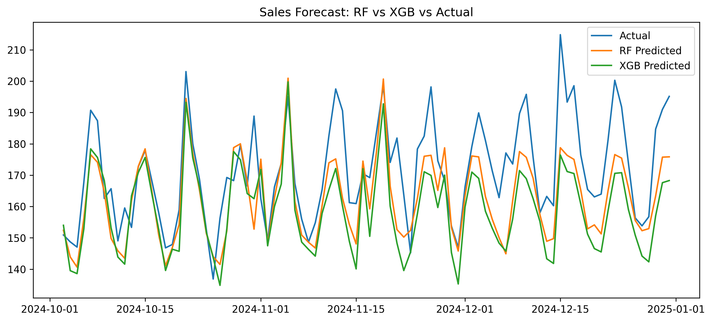
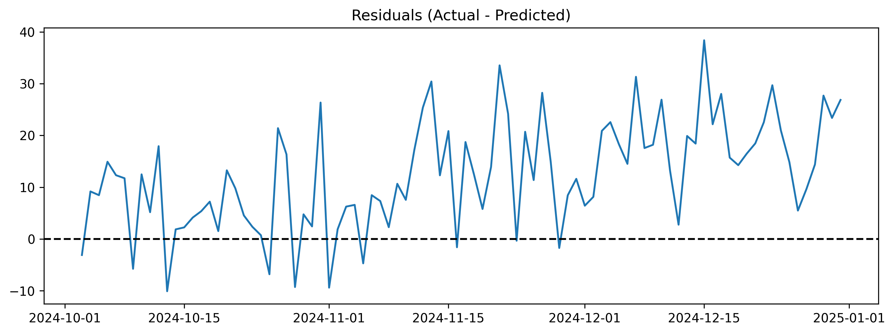

# Sales Forecasting Project 📈

## Overview
This project builds and evaluates machine learning models to forecast daily sales using historical data.  
The pipeline covers the full workflow:

- **Data Preparation**: cleaning & feature engineering (lags, rolling means, time features).  
- **Baseline Model**: Naive forecast (yesterday’s sales).  
- **Machine Learning Models**:
  - Random Forest Regressor
  - XGBoost Regressor (or HistGradientBoosting if XGB not available)  
- **Evaluation**: Holdout validation, residual analysis, and rolling-origin backtesting.  
- **Forecasting**: 30-day forward forecast with prediction intervals (±1σ, ±2σ).  
- **Deployment**: Notebook `03_evaluation_and_deployment.ipynb` generates results & saves outputs.  


---
## Written Results

### Model Performance

| Model             | MAE    | RMSE   | Notes                                |
|-------------------|--------|--------|--------------------------------------|
| Naive (Lag-1)     | 13.603 | 16.571 | Simple baseline using yesterday’s sales |
| Random Forest     | 10.188 | 13.107 | Best performer among tested models     |
| XGBoost           | 13.537 | 16.182 | Performed similar to baseline, less effective than RF |

---

### Forecast Example (first 5 days of 2025)
| Date       | Forecast |
|------------|----------|
| 2025-01-01 | 155.83   |
| 2025-01-02 | 145.42   |
| 2025-01-03 | 144.52   |
| 2025-01-04 | 149.18   |
| 2025-01-05 | 160.75   |

---

### Residual Analysis
- Residual standard deviation (σ): **11.24**  
- Residuals are roughly centered at zero, but variance is higher around promotions/holidays.  
- Prediction intervals (±1σ, ±2σ) capture most future uncertainty.  

---

### Key Insights
- **Random Forest achieved the best accuracy** (lowest MAE & RMSE).  
- **Naive performed decently** but was clearly outperformed by RF.  
- **XGBoost did not outperform RF** in this dataset (possible due to small dataset size or tuning needs).  
- Forecast for early January 2025 shows sales around **145–160 units/day** with expected fluctuations.  

## Results

### Actual vs Predicted


### RF vs XGB vs Actual


### Residuals


### Residual Distribution


### Future Forecast


### Forecast with Prediction Intervals


---

## How to Run

1. Clone this repo:
   ```bash
   git clone https://github.com/your-username/ai_internship.git
   cd ai_internship/sales_forecasting

2. Install dependencies:
   pip install -r requirements.txt

3. Open notebooks:
   jupyter notebook notebooks/

4. Run all notebooks in order:
   01_data_prep.ipynb
   02_modeling.ipynb

---
